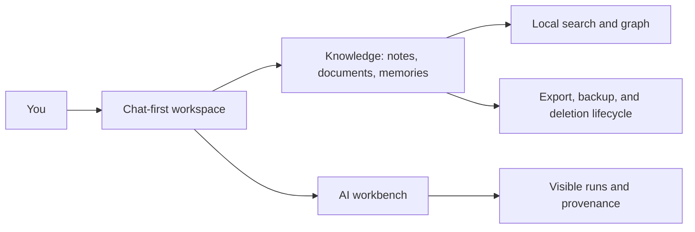
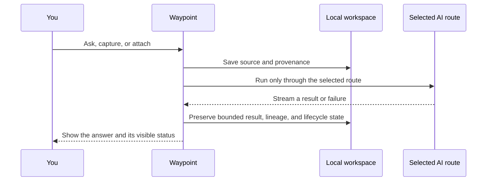

<p align="center">
  
</p>

<h1 align="center">Waypoint</h1>

<p align="center">
  <strong>A private, local-first AI workspace for the work you want to remember, understand, and move forward.</strong>
</p>

<p align="center">
  <a href="#what-it-is">What it is</a> ·
  <a href="#start-here">Start here</a> ·
  <a href="#what-you-can-do-today">Capabilities</a> ·
  <a href="#privacy-and-data-boundaries">Privacy</a> ·
  <a href="#project-status">Status</a>
</p>

<p align="center">
  
  
  
  
</p>

---

## What it is

Waypoint is a desktop workspace that brings together durable chat, notes, documents, memories, search, and local AI work into one place. It is designed to remain useful offline and without a server: your workspace lives on your device, while optional capabilities are explicit and visible.

The product is chat-first. The interface is there to inspect, search, and recover your work; the conversation is where work begins.



## What you can do today

| Area | Waypoint capability |
| --- | --- |
| **Think in context** | Keep durable chats, revisioned notes, attachments, memories, and relationships inside separate workspaces. |
| **Find the thread** | Search local text across workspace content and navigate a knowledge graph with traceable source relationships. |
| **Bring your own AI access** | Use already signed-in Codex or Claude Code CLIs; optional OpenRouter support has protected-key storage, explicit activation, model preferences, and spend controls. |
| **Work with documents** | Import PDF, DOCX, plain text, and Markdown with source and extractor provenance, deterministic chunks, lifecycle-aware reindexing, and optional local semantic indexing. |
| **Talk instead of type** | Use the bundled local voice path through one compact composer control. Microphone use starts only when you start a voice session. |
| **Keep a real record** | Inspect content, execution, sync, rule, lifecycle, and maintenance activity without exposing raw secrets in the timeline. |
| **Recover deliberately** | Export, verify backups, exercise isolated restore drills, and use deletion behavior that removes owned derived state instead of quietly leaving it behind. |

### Built for a trustworthy work loop



## Start here

### Use the current macOS development package

After packaging, open `release/mac-arm64/Waypoint.app` from Finder. If macOS warns about the unsigned development build, use Finder’s **Open** action and review the warning; do not disable Gatekeeper globally.

The packaged app does **not** require Node.js, npm, Docker, or a coordination server for ordinary local work.

For a fuller walkthrough, see [Getting started on macOS](docs/GETTING_STARTED_MACOS.md).

### Build from source

Requirements: Node.js 24.15, npm 12.0, and a repository checkout. Docker is neither required nor used.

```sh
# Activate .nvmrc with your Node version manager first (for example: fnm use).
npm ci
npm test
npm run lint
npm run build
npm run package:dir
```

`npm run dev` starts the renderer development server. Use the packaged application for desktop evaluation.

### Optional local integrations

- **Codex / Claude Code:** install and sign in using the vendor’s normal CLI flow. Waypoint uses that existing session and does not keep the CLI credential.
- **Semantic search:** install Ollama separately if you want local embeddings. Waypoint only accepts a loopback endpoint; ordinary text search works without it.
- **OpenRouter:** add a key through Settings, then explicitly enable hosted requests. Provider usage is subject to configured cost caps and visible receipts.

## Privacy and data boundaries

Waypoint’s default posture is intentionally plain:

- Workspace data, attachments, search indexes, and execution provenance remain local by default.
- Raw microphone audio is ephemeral for voice interaction; it is not treated as chat content, backup content, or relay payload.
- Provider keys stay in protected local storage and are excluded from workspace export, sync, relay data, and execution receipts.
- Diagnostics and exports stay local until you choose to share a file.
- Deleting a source removes its owned derived state, such as attachments, indexes, relationships, and applicable execution records.

Read the details before using Waypoint with important material: [data boundaries](docs/DATA_BOUNDARIES.md) · [backup and recovery](docs/BACKUP_AND_RECOVERY.md).

## Project status

Waypoint is an actively developed, private desktop project. The current verification focus is macOS on Apple silicon; Windows is a peer target but still requires its own native validation, signing, and release evidence.

| Available or in current local verification | Explicitly not claimed as release-ready |
| --- | --- |
| Native macOS desktop package, local workspaces, chat, search, documents, backups, optional local AI routes, and visible activity | Public distribution, automatic updates, signing/notarization, and Windows-native release validation |
| Local-first use without Docker or a server | A guarantee that third-party accounts, external connectors, or remote sync are enabled for every user |
| An opaque relay and desktop sync foundations | Cross-device readiness without the required physical-device validation matrix |

The complete product direction, decisions, and staged evidence live in the repository:

- [MVP plan](outputs/MVP_PLAN.md)
- [Product architecture](outputs/PRODUCT_ARCHITECTURE.md)
- [Roadmap](outputs/ROADMAP.md)
- [Implementation status audit](outputs/IMPLEMENTATION_STATUS_AUDIT.md)
- [Decision log](outputs/DECISION_LOG.md)

## Development notes

This repository favors evidence over implied capability. A feature may have an interface or a local contract before it has authority to contact an account, send data, perform external writes, or claim cross-platform release readiness. Those gates are intentional.

If you are evaluating a local build, start with a disposable workspace and create an export before putting in material you cannot afford to lose. See [troubleshooting](docs/TROUBLESHOOTING.md) and the [release checklist](docs/RELEASE_CHECKLIST.md) for the current boundaries.

Repository delivery uses [pinned CI and merge-release automation](docs/RELEASE_AUTOMATION.md). Successful `main` verification produces private unsigned macOS arm64 and Windows x64 prereleases; production signing and Linux publication remain separate evidence-backed gates.

---

<p align="center">
  <strong>Waypoint</strong><br />
  <sub>Find the signal. Keep the context. Move work forward.</sub>
</p>
