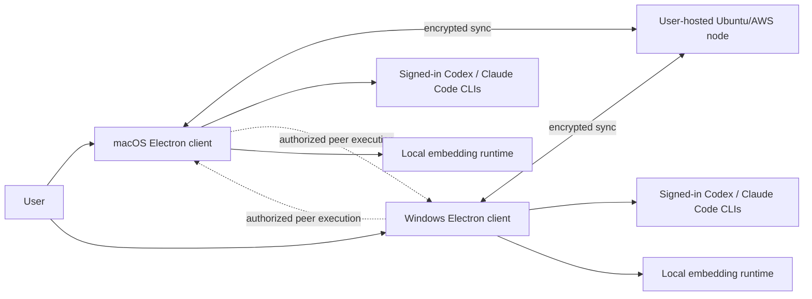

# Waypoint product architecture

This document defines architectural intent and boundaries, not an implementation specification.

## System context

## Architectural boundaries

### Desktop clients

Each peer is a useful local application, not a thin view over a server. It owns:

- the interactive UI and guided onboarding;
- a durable local workspace store;
- local text and embedding indexes;
- CLI process supervision and local security enforcement;
- an append-oriented activity view;
- an outbox/inbox for resumable synchronization;
- peer execution approval and revocation.

### User-hosted coordination node

The Ubuntu/AWS node should provide the minimum capabilities required for reliable peer operation:

- authenticated device enrollment and revocation;
- encrypted change relay or synchronization coordination;
- durable delivery of changes and deletion tombstones;
- peer presence/capability discovery;
- optional encrypted backup material only when the user enables it;
- health and storage signals visible to the owner.

It should not silently become the sole source of truth, require plaintext access to user content without an explicit design decision, or hold model-provider credentials.

### CLI execution adapters

Waypoint integrates with installed signed-in Codex and Claude Code CLIs through versioned adapters. The adapter boundary should normalize:

- capability and version detection;
- sign-in/availability state;
- request construction and working-directory selection;
- streaming events and final output;
- cancellation, timeout, and error taxonomy;
- tool and sub-agent activity when exposed by the CLI;
- provenance needed for the activity timeline.

CLI output is untrusted input. Parsing failures must fail closed for privileged actions while preserving raw diagnostic material under the user's retention policy.

## Canonical product object model

| Object | Purpose | Lifecycle owner |
|---|---|---|
| Workspace | Personal data/security/sync boundary | User |
| Document | Durable authored or imported content | Workspace/user |
| Chat | Durable conversational container | Workspace/user |
| Message | Ordered chat entry with provenance | Chat |
| Memory | Curated or derived durable fact/context | Workspace/user or source object |
| Relationship | Typed graph edge between durable objects | Its endpoints/workspace |
| Attachment | Binary content and metadata | Referencing root object or workspace |
| Embedding | Local derived search representation | Source revision |
| Execution | One routed CLI/agent run | Requesting chat/task |
| Activity event | Content-minimized audit/timeline record | Workspace retention policy |
| Device | Enrolled peer identity and capability record | Workspace/user |
| Change/tombstone | Sync convergence record | Source object + retention policy |

Ownership must be explicit. References do not automatically imply ownership; otherwise deleting a chat could unexpectedly delete a shared document.

## Cascade deletion contract

“Delete” means the product can enumerate and purge all owned content and derived representations.

For a deleted root object, Waypoint must address:

1. child records and revisions;
2. owned attachments and caches;
3. embeddings and full-text index entries;
4. graph edges touching the deleted object;
5. queued or resumable executions whose required context was deleted;
6. synchronized replicas and server-held change payloads;
7. exports or backups according to their separately disclosed retention policy;
8. activity events, which must retain only content-minimized evidence of the operation.

Deletion is a distributed state transition: create a sync-safe deletion marker, prevent stale updates from resurrecting content, converge peers, then physically purge the marker after the stated retention and peer-safety conditions. “Remove from the UI” is never sufficient.

## Sync invariants

- A peer can continue local work while the node is unavailable.
- Every mutation has a stable object identity, causal/version metadata, origin device, and timestamp used only with understood clock limitations.
- Conflict behavior is deterministic and visible; content conflicts preserve recoverable variants rather than silently discarding one.
- Deletion dominates stale offline edits unless the user explicitly restores into a new object identity.
- Enrollment is explicit; revocation stops future synchronization and execution authorization.
- Protocol and schema versions support staged upgrades across Mac, Windows, and server.
- Large binary transfer is resumable and integrity checked.

The specific conflict algorithm remains an open technical choice; prototype it against documents, ordered chat messages, graph edges, and deletion before committing.

## Local embeddings

- Embedding generation and indexing remain on the client by default.
- Each vector is tied to a source object, exact source revision, chunking policy, model identifier, and model version.
- Re-indexing is resumable and does not block ordinary authoring.
- A user can see indexing state and clear/rebuild the index.
- Deletion of a source revision deletes its vectors.
- Cross-device portability of vectors is optional; recomputation may be preferable to sync if model availability is controlled.

## Model routing and orchestration

Routing is a product surface, not hidden plumbing. An execution should expose:

- requested task and initiating user/action;
- selected CLI/model when the CLI makes model identity available;
- execution device;
- security profile and granted roots/tools/network policy;
- coordinator and child-agent lineage;
- status, elapsed time, cancellation, and artifacts;
- failures or fallback decisions.

The MVP permits bounded multi-agent orchestration but requires explicit lineage and a finite execution budget. Autonomous recursive delegation, unbounded retries, and invisible provider fallback are outside the MVP.

## Security profiles

A security profile is a named, inspectable capability bundle. At minimum it should constrain:

- filesystem roots and read/write mode;
- network availability or destinations where enforceable;
- executable/tool allow-list;
- local versus peer-device eligibility;
- approval requirements;
- maximum run duration and concurrency;
- secrets made available to the process.

Default onboarding should create a conservative profile. Profiles must be applied and enforced on the execution device; a requesting peer cannot grant itself broader rights remotely.

## Activity timeline

The timeline combines user-relevant events across content, AI, sync, devices, and security. It is not a raw log dump. Events should be structured, filterable, link to surviving objects, and minimize captured content. Sensitive command output and document contents follow workspace retention rules rather than being duplicated indefinitely into events.

## Future capability seams

- **Audio-only meetings:** recording consent, local capture, transcription, speaker handling, and deletion form a separate privacy boundary.
- **Proactive webhooks:** signed ingress, replay protection, idempotency, routing policy, and visible execution consent.
- **Unified calendar:** account-scoped credentials, normalized events, conflict handling, and explicit write authority.
- **Schedules/playbooks:** versioned definitions, dry runs, permission snapshots, failure policy, and audit history.
- **Sandboxing:** stronger OS-specific isolation beyond profile-level capability controls.
- **Health/backup:** diagnostics, encrypted backup targets, restore drills, and version compatibility.
- **Mobile companion:** capture/notification/review first; peer-equivalent execution is not assumed.

## Threat-model prompts before beta

- Can a malicious document or CLI output escalate a privileged execution?
- Can a compromised coordinator read content or impersonate a device?
- Can a revoked or long-offline peer resurrect deleted data?
- Can timeline/provenance data leak content the user deleted?
- How are local CLI credentials inherited, isolated, and excluded from sync?
- What happens when one peer runs an incompatible app, schema, or embedding model version?
- Which metadata remains visible to the coordination node under the chosen encryption design?
